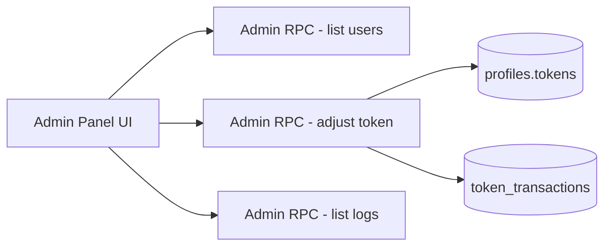

## Amaç
Admin paneline yalnızca `tahircan.kozan@hotmail.com` kullanıcısının erişebileceği, üyelerin token bakiyeleri ve işlem geçmişlerini görüntüleyip manuel token ekleme/çıkarma yapabileceği modern bir bölüm eklemek. Mevcut token sistemi (RPC + RLS) ile uyumlu çalışacak; gerekli yeni RPC ve log tablosu eklenecek.

## Varsayımlar ve Netlikler
- Admin erişimi sadece `profiles.email = 'tahircan.kozan@hotmail.com'` koşuluyla sağlanacak.
- Token geçmişi için mevcut tablo bulunmadığından yeni log tablosu oluşturulacak.
- Token yönetimi sadece manuel ekleme/çıkarma (sebep alanı opsiyonel veya zorunlu değil) olacak.
- Backend Supabase RPC + RLS kullanılacak.

## Değişiklik Alanları (Dosya/Şema)
- `src/components/AdminPanel.jsx`
  - Yeni sekme: **Kullanıcılar / Token Yönetimi**
  - Üye listesi + token bakiyesi görünümü
  - Kullanıcı arama ve tarih aralığı filtreleme
  - Seçili kullanıcıya manuel token ekle/çıkar işlemi
  - Token işlem geçmişi tablosu
- `src/services/authService.js`
  - Admin için token loglarını ve kullanıcı listesini getiren servis fonksiyonları
  - Admin token ekle/çıkar RPC çağrıları
- `supabase/migrations/001_profiles_table.sql` (veya yeni migration dosyası)
  - `token_transactions` (log) tablosu
  - Admin işlemleri için RPC: `admin_adjust_token(user_id, amount, reason)`
  - Admin listeleme için RPC: `admin_list_users_tokens()`
  - Log getirme için RPC: `admin_list_token_logs(user_id, start_date, end_date)`
  - RLS politikaları: sadece admin e‑posta erişebilecek şekilde

## Plan
### 1) Admin yetki modeli
- `profiles` tablosunda admin belirleme için ek alan eklemeden, **e‑posta bazlı** kontrol uygulanacak.
- Frontend’de `/admin` sayfasına girmeden önce `AuthContext` üzerinden mevcut kullanıcının email kontrolü yapılacak ve admin değilse admin paneli görünmeyecek.
- Backend tarafında da RPC fonksiyonları **sadece admin e‑posta** ile çalışacak şekilde güvenlik kontrolü içerecek.

### 2) Veritabanı: Token işlem geçmişi
- Yeni tablo: `token_transactions`
  - `id`, `user_id`, `amount`, `balance_after`, `action_type`, `reason`, `created_at`, `created_by`
- `amount` pozitif/negatif destekleyecek (ekle/çıkar).
- `created_by` admin kullanıcısının id’si olacak.

### 3) Admin RPC fonksiyonları
- `admin_adjust_token(user_id, amount, reason)`
  - Yetkili admin kontrolü
  - Token bakiyesini atomik güncelleme
  - Log tablosuna kayıt (amount, balance_after, created_by, reason)
- `admin_list_users_tokens()`
  - Kullanıcıların `full_name`, `email`, `tokens` listesini döndürür
- `admin_list_token_logs(user_id, start_date, end_date)`
  - İlgili kullanıcı veya tüm kullanıcılar için tarih aralığına göre log getirir

### 4) Frontend: Admin panel sekmesi
- `AdminPanel.jsx` içinde yeni sidebar item: **Kullanıcılar**
- Yeni içerik alanı:
  - Üye listesi tablosu (isim, e‑posta, token)
  - Arama kutusu (isim/e‑posta)
  - Tarih aralığı filtreleme (başlangıç/bitiş)
  - Kullanıcı seçimi ve token ekle/çıkar formu
  - Token işlem geçmişi tablosu (tarih, işlem türü, miktar, kalan token, sebep, admin)
- Tasarım: mevcut tema paleti ve kart yapılarıyla uyumlu; butonlar altın tonlu vurgular.

### 5) Servis katmanı
- `authService.js` içine admin RPC çağrıları için fonksiyonlar eklenir:
  - `adminListUsersTokens()`
  - `adminAdjustToken(userId, amount, reason)`
  - `adminListTokenLogs({ userId, startDate, endDate })`

### 6) Doğrulama ve güvenlik
- Admin olmayan kullanıcı admin panelini göremez.
- RPC fonksiyonları admin e‑posta kontrolü ile korunur.
- Log tablosuna yazılmayan token değişikliği olmamalı.

## Doğrulama / DoD
- Admin panelinde **Kullanıcılar** sekmesi görünür ve kullanıcı listesi yüklenir.
- Kullanıcı araması ve tarih aralığı filtreleri çalışır.
- Admin manuel token ekleyip çıkarabilir; bakiye güncellenir.
- Token işlem geçmişi tabloya doğru şekilde düşer.
- Admin olmayan kullanıcı `/admin` rotasında içerik göremez.

## Adım → Hedef → Doğrulama Eşlemesi
1. **Yetki modeli** → admin erişim kontrolü → admin olmayan kullanıcı paneli göremez
2. **DB log tablosu** → token işlemleri kayıt altına alınır → log tablosunda kayıt oluşur
3. **Admin RPC** → güvenli token yönetimi → RPC çağrıları admin dışına kapalı
4. **UI sekmesi** → kullanıcı listesi + loglar görünür → ekranlarda veri görünür
5. **Servis katmanı** → API çağrıları çalışır → kullanıcı listesi ve loglar yüklenir
6. **Manuel token işlemi** → bakiye/log güncellenir → işlem sonrası yeni bakiye görünür

## Görsel Akış (Mermaid)

